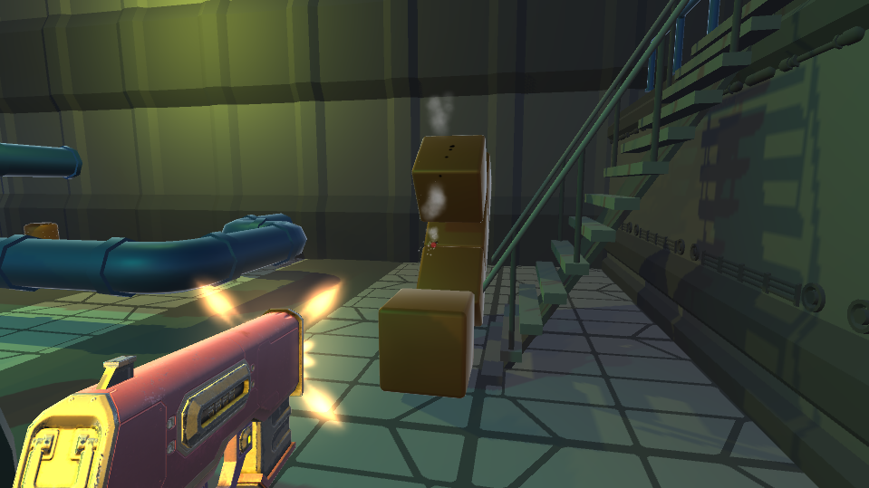

# GametopiaFPS
 
 

FPS Project for a Gametopia course  

My first ever 3D FPS game with Unity. 
Made for Gametopia "Programming with Unity" course. https://www.gametopia.es/learning/curso-unity3d-videojuegos  

You can play it here: https://play.unity.com/mg/other/webgl-builds-75066  

@Kevin Martínez Leiva - 2020
